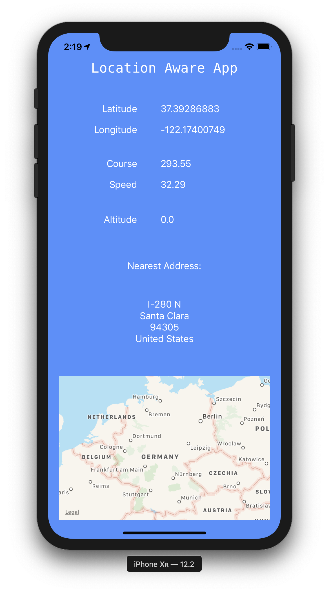

# 📲 Location Aware App
-
[](https://opensource.org/licenses/MIT) [](https://GitHub.com/Naereen/StrapDown.js/graphs/contributors/) [](https://github.com/ellerbrock/open-source-badges/) [](https://saythanks.io/to/kennethreitz)

[](https://GitHub.com/Naereen/)

[](https://forthebadge.com)



```swift
func locationManager(_ manager: CLLocationManager, didUpdateLocations locations: [CLLocation]) {
        
        let location = locations[0]
        
        self.latitudeLabel.text = String(location.coordinate.latitude)
        
        self.longitudeLabel.text = String(location.coordinate.longitude)
        
        self.courseLabel.text = String(location.course)
        
        self.speedLabel.text = String(location.speed)
        
        self.altitudeLabel.text = String(location.altitude)
        
        CLGeocoder().reverseGeocodeLocation(location) { (placemarks, error) in
            
            if error != nil {
                
                print(error as Any)
                
            } else {
                
                if let placemark = placemarks?[0] {
                    
                    var address = ""
                    
                    if placemark.subThoroughfare != nil {
                        
                        address += placemark.subThoroughfare! + " "
                        
                    }
                    
                    if placemark.thoroughfare != nil {
                        
                        address += placemark.thoroughfare! + "\n"
                        
                    }
                    
                    if placemark.subLocality != nil {
                        
                        address += placemark.subLocality! + "\n"
                        
                    }
                    
                    if placemark.subAdministrativeArea != nil {
                        
                        address += placemark.subAdministrativeArea! + "\n"
                        
                    }
                    
                    if placemark.postalCode != nil {
                        
                        address += placemark.postalCode! + "\n"
                        
                    }
                    
                    if placemark.country != nil {
                        
                        address += placemark.country! + "\n"
                        
                    }
                    
                    self.addressLabel.text = address
                    
                }
                
            }
            
        }
        
    }
    
        
```